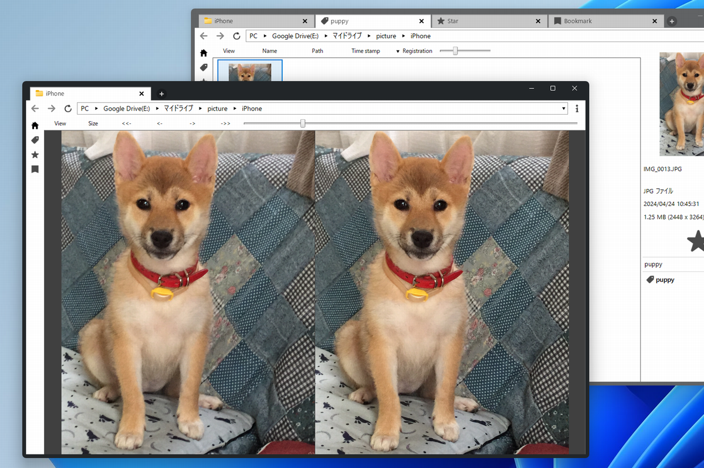

 

# PicSum

## Software Overview
* PicSum is a tabbed image viewer.
* Images can be displayed in a double-page spread.
* Various functions are provided for organizing image files.

## Functions
### Tabs
* Tabs can be added, deleted, and windows can be combined or separated.
### Home Page
* Displays a list of frequently accessed folders.
### Stars
* Files and folders can be starred.
### Tags
* Files and folders can be tagged.
### Bookmarks
* Image files within a folder can be bookmarked.
### Clips
* Files and folders are remembered only while the application is running.
* Images can also be clipped by middle-clicking on the image page.
### Export
* Image files can be exported to any folder.

## Supported image formats
* `Avif`
* `Bmp`
* `Gif`
* `Ico`
* `Jpeg`
* `Jpg`
* `Heic`
* `Heif`
* `Png`
* `Svg`
* `Webp`

## Startup options
* If you run picsum with the `--empty` option, no page will be displayed at startup.
* If you run picsum with the `--cleanup` option, it will optimize the picsum database and delete the thumbnail cache before starting.

## How to build
1. Install `.Net 8.0`.
1. Install `Visual Studio 2022`.
1. Run the `build_release.bat` file.

## Operating environment
* Windows 10 (64bit)
* Windows 11 (64bit)

## Screenshot

