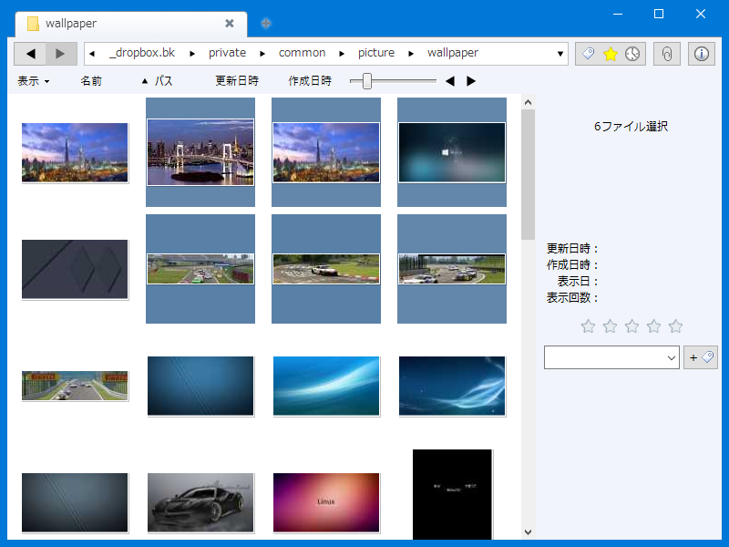
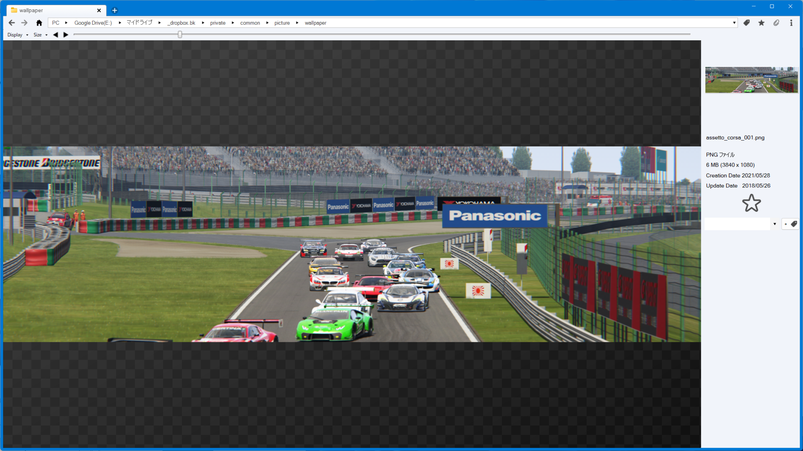

# PicSum
This application browses and displays image files.

## How to build
1. Install `.Net 4.8.1`.
1. Install `Visual Studio 2022`.
1. Run the `build_release.bat` file.

## How to start
Run `picsum.exe` in the `bin_release` directory created by the build.

## Screenshot

