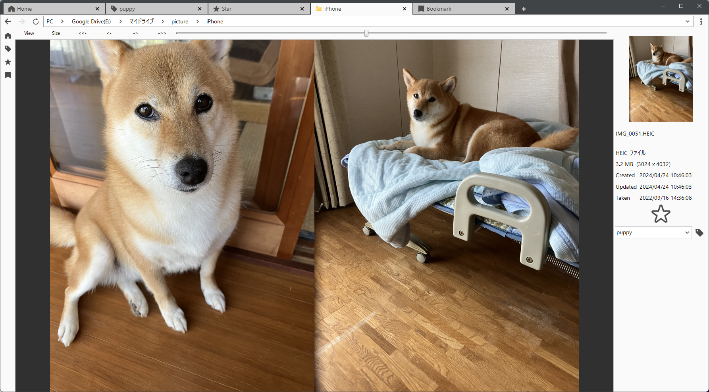
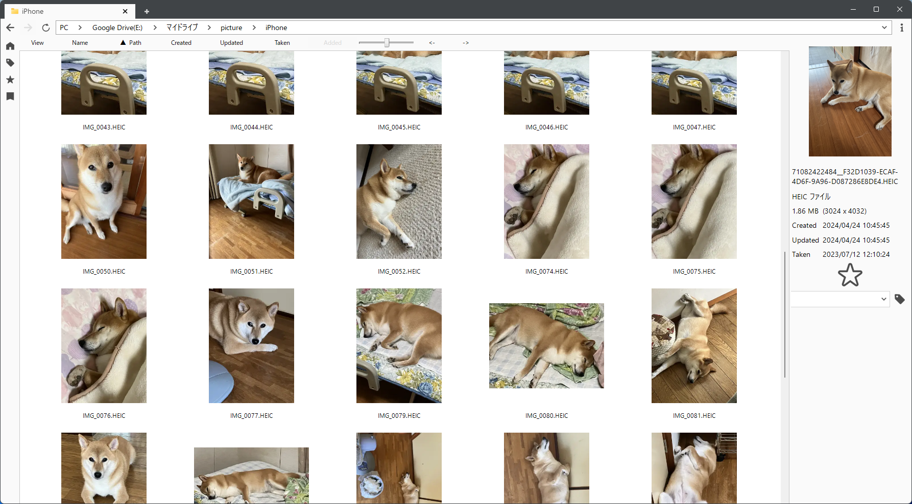

 

# PicSum

## Software Overview
An Intuitive and Comfortable Photo Viewer
PicSum is a photo viewer with a tab function, similar to a web browser. It features fast startup and loading times, which allows for a smooth Browse experience. It also supports spread view, so you can display multiple photos side by side. What's more, it has an address bar like a file explorer, making folder access easy.

* Please note: This application specializes in viewing photos and does not have any editing functions.

## Features
### Tabs
You can add, delete, merge, and separate windows.

### Address Bar
The address bar is a breadcrumb list, making it easy to navigate between folders.

### Home
This displays a list of frequently accessed folders.

### Star
You can star files and folders.

### Tags
You can add tags to files and folders.

### Bookmarks
You can add bookmarks to photos within a folder.

### Export
You can drag and drop photos to export them to any folder. The original files will not be changed.

## Supported image formats
* `Avif`
* `Bmp`
* `Gif`
* `Ico`
* `Jpeg`
* `Jpg`
* `Heic`
* `Heif`
* `Png`
* `Svg`
* `Webp`

## Startup options
* If you run picsum with the `--cleanup` option, it will optimize the picsum database and delete the thumbnail cache before starting.

## How to build
1. Install `Visual Studio 2022`.
1. Run the `build_publish.bat` file.

## Operating environment
* Windows 10 (64bit)
* Windows 11 (64bit)

## Screenshot

